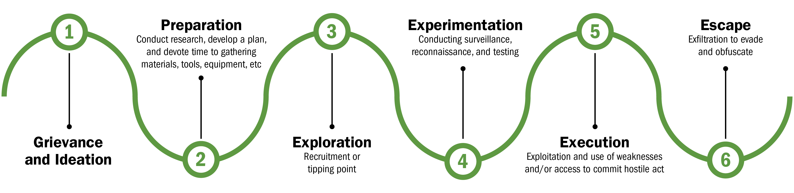

## Question 1 - Detecting reconnaissance from insider threats

### What data should be collected and where

Insider threats are potentially more likely to target high value systems as they already have an in-depth working knowledge of the company network/systems. Once they have decided on their target they will undertake reconnaissance on their target to further increase their knowledge of the system and formulate plans for exploitation and extraction. This is shown as stage 4 in the timeline of insider attacks laid out by CISA below.

Figure 1. Timeline of insider threats (CISA, n.d)

Initial reconnaissance attempts by the attacker are likely to be passive. Passive reconnaissance in this context would include them interacting with employees that are closer to the target system and using third-party software like Wireshark to perform network reconnaissance. Detecting these indicators of impending insider threat will involve 

Active reconnaissance will involve the attacker using more obvious techniques to gather information. These techniques include port-scanning, fingerprinting, and enumeration (Mazurczyk & Caviglione, 2021). This type of reconnaissance attempts can be detected by 

Inter-Employee communications

Technological and human based monitoring

### What tools and what activity

Implementing an end-point security monitoring (ESM) solution in employee workstations

### Strats to help overcome scale

## Question 2 -  Statistical Data Collection

## Question 3 - Snort or Zeek?

## Question 4 - Responding to an incident

## Question 5 - Advanced persistent Threats

## Question 6 - Cost effectiveness

## References

CISA. n.d. Detecting and Identifying Insider Threats. https://www.cisa.gov/detecting-and-identifying-insider-threats

Mazurczyk, W., & Caviglione, L. (2021). Cyber reconnaissance techniques. Communications Of The ACM, 64(3), 86-95. https://doi.org/10.1145/3418293