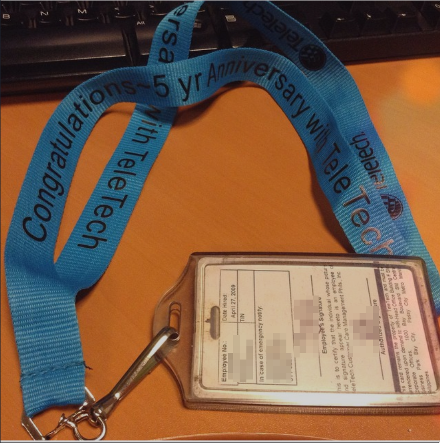

# 
 Module: 245CT Ethical Hacking 1 

## 
 Vulnerability Report 

## 
 Student ID: 9195071 

## Table Of Contents:

---
  - [Introduction](#introduction)
  - [Passive Recon](#passive-recon)
    - [Introduction](#introduction-1)
    - [Discussion of this topic including:](#discussion-of-this-topic-including)
    - [Considerations for mitigating this problem in general.](#considerations-for-mitigating-this-problem-in-general)
    - [Social, Legal and Ethical considerations with this particular topic](#social-legal-and-ethical-considerations-with-this-particular-topic)
  - [Phishing](#phishing)
    - [Introduction to the topic: What it is, and why it is of interest in Cyber security](#introduction-to-the-topic-what-it-is-and-why-it-is-of-interest-in-cyber-security)
    - [Discussion of this topic including:](#discussion-of-this-topic-including-1)
    - [Considerations for mitigating this problem in general.](#considerations-for-mitigating-this-problem-in-general-1)
    - [Social, Legal and Ethical considerations with this particular topic](#social-legal-and-ethical-considerations-with-this-particular-topic-1)
  - [Conclusion](#conclusion)
  - [References](#references)
---

## Introduction

## Passive Recon

### Introduction

Reconnaissance is the act of surveying and researching a target with its main goals being 'the identification of weak points of the target and the setup of an effective attack plan' (Mazurczyk & Caviglione, 2021). Reconnaissance can be broken down into two types: passive (Indirect and less obvious) and active (Directly interacting with a system). This section of the report will focus on the former: Passive reconnaissance.

Active reconnaissance can reveal more tangible information such as open ports and vulnerabilities when compared to passive methods. This comes with the risk of early detection by security departments and the failure of an attack. Passive recon mitigates this by interacting with less obvious parts of the target's infrastructure such as employee social media pages and DNS records. According to Zwilling et al. (2020) "the average employee in 2021 will often fail to possess the minimum required knowledge to protect their computing devices". This lack of key knowledge causes sites such as Instagram and Twitter to host a treasure trove of personal information, password clues and blindly uploaded photographs of ID badges and company infrastructure. Unless the population is educated on this topic, companies can continue to spent millions of pounds on security devices, anti-virus and security teams while letting their employees be their largest security risk.

### Discussion of this topic including:

    Technical / Practical implementation of the topic (How does this work)

    Example of the topic in the "Real world"

The US government in the Defense Authorization Act defines OSINT (Open-source intelligence) as 'intelligence that is produced from publicly available information for the purpose of addressing a specific intelligence requirement' (2006). Publicly available information can be found in many places, social media holding the most amount of useful information to be used by attackers. There is so much information to be found here due to the lack of public education about the consequences and risks involved in putting this information into the public domain.

Sites such as Twitter and Instagram provide a feature that can aid a researcher greatly: Hashtags. Hashtags are utilised by users almost as decoration to their post with no thought put into them, for researchers they act as a catagorisation method.

> Instagram hashtags - #newjob #newID #newlanyard

> Using a #newjob search with the company in a separate hashtag also gives us the opportunity to target newer employees that are going to be less aware of company policy and structures, offering a better chance of phishing success.

> People are often excited about new jobs and opportunities, immediately taking to social media to share the news with their friend, and everyone else on the internet. These posts can contain full, uncensored views of their ID/Entry cards for events or jobs. These can be easily copied and used in social engineering campaigns, if someone is wearing the same lanyard as the rest of the crowd the security wont bat an eyelid.

> Fully visible barcode for door entry or system login in this twitter post, along with department and full name.

    Discussion of the topic in the wider security context (What does it mean in terms of security, how common is it, how "dangerous" is the vulnerability)

> A single social media post can compromise the security of whole branches of business or government.
> Danger depends on the person posting the information, the type of information, how much is shown etc...

### Considerations for mitigating this problem in general.

> Better training for employees

> Wider spread knowledge of the danger posting personal info online to the population

> 

### Social, Legal and Ethical considerations with this particular topic

---

## Phishing

OWASP defines phishing as: "cybercrime in which a target or targets are contacted by email, telephone or text message by someone posing as a legitimate institution to lure individuals into providing sensitive data" (n.d). There are many different forms of phishing depending on the medium used and the target of the attack. The most common would be email phishing where usually mass emails are sent out in order to steal credentials or financial information. Some attackers will focus on specific targets, usually high up in a companies structure in 'Whaling' campaigns. These will often have much higher consequences for the target but are much harder to pull off and take a long time to set up and execute.

---

Phishers will employ a large range of tactics in order to make a user reveal information about themselves. Disguising links to trick the user into thinking they are legitimate is chief among these tactics. As shown in figure 1, a URL in an email can direct a user to a completely different website to what is shown in the email body. In a real phishing campaign 'EvilWebsite.gg' would be a clone of Facebook.com in order to fool the user into entering personal information. 

>Figure 1. Deceptive URL example in Gmail.

Now, 'EvilWebsite.gg' would be a dead giveaway of the malicious intent behind the email for a large majority of users. Another tactic is employed to mitigate this issue in the form of subdomains. Subdomains are commonly used to organise different sections of a website, phishers capitalise on this to make URLs seem to be legitimate. For example take the URL 'facebook.com.EvilSite.uk'. 'EvilSite.uk' is the domain of the website with 'facebook.com' being a subdomain. To take this further the phishers will often use multiple subdomains like in the URL 'facebook.com.0182897279056903246598342760264.22132232878927350897548947532421.4212749032870496789027890487287025245.uk'. If the link is long enough the '.uk' will fall out of sight for the user and to the untrained eye could look like a link to a post on the legitimate site. This is demonstrated in figure 2.

> Figure 2. A URL with many subdomains can obscure parts of the link off the screen.

    Example of the topic in the "Real world"
    
    Discussion of the topic in the wider security context (What does it mean in terms of security, how common is it, how "dangerous" is the vulnerability)

Due to the ongoing pandemic there has been a sharp rise in people relying totally on digital communications for work and social life. A rise of 7% in general internet users across the globe along with an 8% rise in active social media users puts social media users at just under 50% of the global population (Kemp, 2021). Inevitably cyber criminals have seen this trend and grasped the opportunity to attack new victims with both hands. Phishing attack reports in 2019 reached 114,702 complaints, this increased to 241,342 complaints in 2020. Thats a 110% increase in a year but when compared to 2018s complaint number (26,379) that's a 815% increase in just two years (FBI, 2021). This is a worrying trend that will increase with the populations reliance on cyber communications and highlights the severity of the problem surrounding phishing.

---

A recent example of a high profile successful phishing attack would be the twitter bitcoin scam in 2020. The attackers used passive reconnaissance to perform a social engineering attack on low-level twitter employees and gain a foothold, then switched to a 'vishing' (phone phishing) attack using these low-level employee accounts to attack higher level employees that could access administrative tools (Whittaker, 2020). These tools allowed the attacker to take control of over 100 extremely high profile twitter accounts and launch a mass phishing attack on their collective millions of followers, promising to double any money sent to a bitcoin wallet address.

This attack using a combination of social engineering and phishing highlights the issue of employees in the security of a company

---

### Considerations for mitigating this problem in general.

Machine learning is an option that has been considered for tackling this problem. Each phishing email will contain certain similarities such as a structure: Billing issue, contest winner, contract expiration, etc (Diaz et al., 2019). Training neural networks to recognise these will enable anti-virus software to detect phishing emails and warn users against the possible scam. Many neural networks to detect phishing emails have been trialed, when one of these networks was compared to other machine learning algorithms it acquired 95.51% accuracy and a 95.71% F1 score (Mahdavifar & Ghorbani, 2019). This is not a guarantee every phishing email will be caught or a false positive wont be thrown up but it would provide users with little knowledge a much better base to fight the scams from.

> education

---

### Social, Legal and Ethical considerations with this particular topic

> Do you want an antivirus to read every email you own to prevent phishing attacks?
>https://palant.info/2019/10/28/avast-online-security-and-avast-secure-browser-are-spying-on-you/

> something  

> something

---

## Conclusion

> Heavy on employees

> Going further into the data age we should be educating people from a young age on the dangers of putting information out into the internet

>

---

## References

US Government. 2006. National Defense Authorization Act for Fiscal Year 2006. Section 931, sub-section (a), paragraph (1). https://www.govinfo.gov/content/pkg/PLAW-109publ163/pdf/PLAW-109publ163.pdf

Mazurczyk, W., & Caviglione, L. (2021). Cyber reconnaissance techniques. Communications Of The ACM, 64(3), 86-95. https://doi.org/10.1145/3418293

Zwilling, M., Klien, G., Lesjak, D., Wiechetek, Ł., Cetin, F., & Basim, H. (2020). Cyber Security Awareness, Knowledge and Behavior: A Comparative Study. Journal Of Computer Information Systems, 1-16. https://doi.org/10.1080/08874417.2020.1712269

Mahdavifar, S., & Ghorbani, A. (2019). Application of deep learning to cybersecurity: A survey. Neurocomputing, 347, 149-176. https://doi.org/10.1016/j.neucom.2019.02.056

Diaz, A., Sherman, A., & Joshi, A. (2019). Phishing in an academic community: A study of user susceptibility and behavior. Cryptologia, 44(1), 53-67. https://doi.org/10.1080/01611194.2019.1623343

Zhang, N., & Yuan, Y. (2012). Phishing detection using neural network. CS229 lecture notes. http://cs229.stanford.edu/proj2012/ZhangYuan-PhishingDetectionUsingNeuralNetwork.pdf

Kemp, S. (2021). Report: Most important data on digital audiences during coronavirus. https://thenextweb.com/news/report-most-important-data-on-digital-audiences-during-coronavirus.

FBI. (2020) Internet Crime Report 2020. Ic3.gov. https://www.ic3.gov/Media/PDF/AnnualReport/2020_IC3Report.pdf.

https://twitter.com/docib/status/1370377004676173827?s=20

https://www.instagram.com/p/y76MQIHKhH/?utm_source=ig_web_copy_link

https://www.sciencedirect.com/science/article/pii/S0925231219302954#bbib0001

OWASP. (n.d). Phishing in depth. https://owasp.org/www-chapter-ghana/assets/slides/OWASP_Presentation_FINAL.pdf.

Whittaker, Z. (2020). A hacker used Twitter’s own ‘admin’ tool to spread cryptocurrency scam. Techcrunch.com. Retrieved 30 June 2021, from https://techcrunch.com/2020/07/15/twitter-hacker-admin-scam/?guccounter=1&guce_referrer=aHR0cHM6Ly9lbi53aWtpcGVkaWEub3JnLw&guce_referrer_sig=AQAAAFmZnh4WqmO5GyWYXRe7xS4r-SbZpCp3OdgRTNyMkKAr2hiLHP1WGKqIHK84WTiP6qC7F9u13omI14h9cjpPGi29QoTPSG4wgM3gklc1qxazNJ_7kIbcJ_dNl0aa2ycnMyD3jhWzudjh0EmQX7ZgEeT1b1ee2EpAtkfXf90xTeNW.